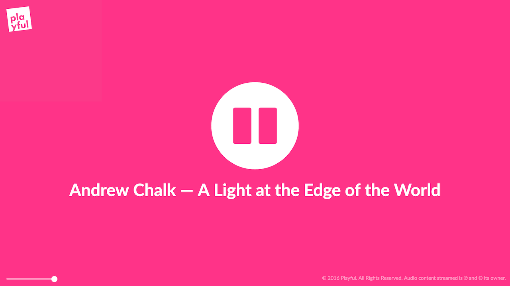

{:target="_blank"}<!-- fix markup display_ -->

For a fun summer project while trying to find a job after my last undergraduate semester, I am working on another radio project -- this time, setting up an internet radio station once again.

> [Click here](http://stream.playful.cc/){:target="_blank"} to launch the Playful Stream.<!-- fix markup display_ -->

## Background

From roughly 2009 to 2011, I owned and operated Indievidual Radio, a boutique radio station designed to serve the needs of a small community of music lovers I was a part of. This station ran on [Icecast][1] and [MPD][2], and I was responsible for installing, configuring, and maintaining the software, managing the station's DJs and their time slots, and also contributing DJ time myself. In a similar vein, I wanted to spend some time recreating a similar setup and working in some new technologies at the same time.

### What this article is not

This article does not explain in full detail how to set up these programs and I am not available to help you do so. I used Google extensively while working on this and that is always a good place to start if you have questions.

## The basic setup

There are four primary components to the setup as it exists now: Icecast, a custom-written HTML5/Javascript front-end, MPD, and ProFTPd.

### Icecast

[Icecast][1] is an open-source free software project maintained by the [Xiph.org Foundation][3] that is designed for media streaming. It is, along with similar project ShoutCAST, responsible for powering the vast majority of streaming audio internet radio stations.

Setting up this software is fairly straightforward, and I'm fortunate in that I've done it before, so there were few hiccups. I set up two mount points: one for DJs to connect to do their shows, and another in advance for when I would set up automation with MPD. Once Icecast was fully configured, I began feeding it with audio data from [Nicecast][4] on my laptop.

### HTML5 front-end

Once I had the Icecast stream sorted out, I began work on a custom front-end written in HTML5 and Javascript. I wanted to have an interface that was both beautiful and simple, and that was where my work began.

First, I set out to set up a basic prototype interface. I happened upon a great pink color with the first color I randomly typed in the CSS code, and gathered some good icons for the loading spinner, play button, and pause button from [FontAwesome][5]. From here, I hooked up the HTML5 `<audio>` element and hooked it up to the pause and play buttons using Javascript and [JQuery][6]. This, for me, represented the base level of functionality -- the stream would play, and it was able to be paused and unpaused.

The next step was to figure out how to display the currently playing track. Some sleuthing revealed to me that there was a `status-json` file I could pull from the Icecast server which, among other things, included the current track titles being played. Some time later, I had written some Javascript code that pulled that json file, got the current track info, and wrote that to screen. Now that we had some text on the screen, I knew it had to be beautiful -- so I grabbed the typeface [Lato][8] from [Typekit][7], also in use on [the main Playful Collective website][9], and used that to style the page. Typekit's great support for OpenType features means that "fi" and similar ligatures render correctly on-screen.

From here, all the basic functionality necessary for a radio station streaming page was present -- we had the audio stream, a track display, and a play/pause control. Now that the basics were dealt with, I could move on to setting up automation.

### MPD

[MPD][2] is another open-source free software project that acts as a server that plays music. Unlike iTunes or WinAMP, where the GUI and music database and playback logic are together in one application, MPD only handles the database and music playback -- it must be controlled by an external client.

I had many issues setting up MPD on the server I'm using -- after a ton of hassles getting MPD to compile with libshout support, which it needs to connect to the Icecast server, it ended up simply [segfaulting][10] at launch every time. Then, the support team at my host introduced me to [Junest][11], with which I was able to simply install it like a regular package, as opposed to the manual compilation I did for everything else, not having root access. (Big thanks to Chance and thebigmunch on the [Whatbox][12] support team for all their assistance.) From here, I configured it to connect to the automation mount point I set up in Icecast, threw a few tracks in the default playlist, and told it to play.

And it worked -- kind of. Audio played just fine, but the Icecast fallback wasn't smart enough to forward the track information from the automation mount to the main mount. I'd have to get a little smarter.

### Back to the front(-end)

The original code that I wrote to pull and display the title data acted on the assumption that only one mount point was active on the Icecast server. In order to deal with this, I had to rewrite most of that code. The new code ranks mount points by the order of preference that their titles would be displayed in, grabs information for all the mount points on the server, and uses the title data for the most preferred mount point that actually has data available. Once this was in place (and some bugs fixed), the titles would automatically transition between the automation mount point and the main mount point depending on whether the main mount point was active. The last major thing I wanted to add was a volume control, and some time later I had a styled and functional volume slider. With some other minor stylistic changes, such as a gradual fade-in once the Typekit fonts have loaded and addition of the Playful logo, the front-end has arrived at its current state.

## Beyond basic functionality

From here there were several things I needed to do. To make automation fully functional, I needed a system for feeding the MPD playlist with new, random tracks from the database. Josh Kunz's [Ashuffle][13] fit the bill exactly, and was reasonably easy to set up.

Next, I wanted to make it easy for friends to add additional music to the server, and to vote on tracks they would like to be played. (This was largely inspired with my past experience with the site [GBS.fm][14], a community radio station implementing both of these features.) For this, I would need an FTP daemon, and some sort of software that would interface with MPD to add new songs when requested.

### ProFTPd

ProFTPd is an open-source free software FTP daemon. As it's what Whatbox recommends and supports for users wanting to set up their own FTP daemons, it was an easy choice. ProFTPd was easily configured to allow listeners to upload new music to a special directory, and, importantly, not see or interact with any other music already existing there. A [symbolic link][15] links from the main music folder (of music I have requisitioned myself) to that folder, enabling MPD to see it.

## Future extension

Left to implement is the voting mechanism. [VoteMPD][16] is an open-source free software project that implements a client for MPD in PHP -- this would provide the voting interface I was hoping for. Unfortunately, once getting the web server to serve it set up, I found that, upon importing the songs, it would crash when importing files containing Unicode data in the ID3 tags. (I have filed a bug for this.) In the meantime, I could simply remove all tracks with Unicode characters from the database, but that will have to remain for another day.

## Current caveats

There are a few drawbacks to the current setup that I would like to resolve at some point. For one thing, the MPD setup is currently unprotected by a password -- the Ashuffle program doesn't support password authentication (yet -- I have an issue filed). Because of this, anyone who can figure out what port I'm running MPD on can log on and queue new tracks. In addition, MPD's automatic database updater doesn't currently follow symbolic links (for which I am following another issue), so files that friends upload to the FTP won't be noticed by MPD until I manually initiate an update. There are also the issues above preventing me from using VoteMPD.

# Conclusion

In just a few days, I've accomplished quite a bit of work -- and this is after not having done any coding for several months. From navigating several new-to-me programs, to coding an entire HTML5/CSS3/JS streaming radio player, I've learned an incredible amount and I'm sure I will continue to as this project expands. It feels good to create things -- especially when their express purpose is sharing things I love with the world.

> Want to check it out? [Click here](http://stream.playful.cc/){:target="_blank"} to launch the Playful Stream.<!-- fix markup display_ --> Follow me on Twitter at [@wonaldson](https://twitter.com/wonaldson).

## Special thanks

I would like to give thanks to the [Whatbox][12] support team, specifically Chance and thebigmunch, for their assistance when I ran into issues -- if you need a Linux shell account host, their customer support is second to none. I'd also like to thank [FontAwesome][5], responsible for the iconography, and [Łukasz Dziedzic][17], who designed the typeface [Lato][8], for being responsible for a significant amount of the look and feel of the site. And, of course, to the tens (or maybe over a hundred) of pieces of advice gleaned from Stack Overflow and other sites while figuring out how to do all of this. (Google is a wonderful tool.)

## Remaining tasks

* Have the title updater wait the length of the current buffer to update title on-screen
* Re-enable MPD password once Ashuffle is updated to support authentication
* Debug UI display when network connection lost
* Probably other things I have forgotten

[1]: http://www.icecast.org/
[2]: https://www.musicpd.org/
[3]: http://www.xiph.org/
[4]: https://www.rogueamoeba.com/nicecast/
[5]: http://fontawesome.io/
[6]: https://jquery.com/
[7]: https://typekit.com/
[8]: https://typekit.com/fonts/lato
[9]: http://playful.cc/
[10]: https://en.wikipedia.org/wiki/Segmentation_fault
[11]: http://fsquillace.github.io/junest-site/
[12]: https://whatbox.ca/
[13]: https://github.com/Joshkunz/ashuffle
[14]: http://gbs.fm/
[15]: https://en.wikipedia.org/wiki/Symbolic_link
[16]: https://github.com/k3x/VoteMPD
[17]: http://www.latofonts.com/
